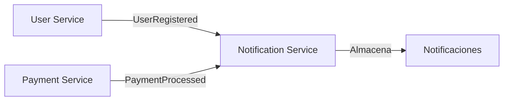

# FitFlow - Services

Microservicios de usuaris, notificaciones y paymente para la plataforma de gimnasio **FitFlow**. Estos servicios son responsables de gestionar usuarios, pagos y notificaciones a los usuarios cuando ocurren eventos importantes en el sistema.

## Arquitectura del Sistema

- **User Service** → Gestión de usuarios y planes
- **Payment Service** → Procesamiento de pagos  
- **Notification Service** → Gestión de notificaciones (este servicio)

### Flujo de Eventos



## Stack Tecnológico

- **Lenguaje**: Python 3
- **Framework**: FastAPI + Uvicorn
- **Base de Datos**: SQL Server (Azure Database for SQL Server)
- **Mensajería**: Redis Streams (Azure Cache for Redis)
- **ORM**: SQLAlchemy 1.4.53
- **Driver BD**: Microsoft ODBC Driver 18 for SQL Server
- **Contenedores**: Docker & Docker Compose
- **Despliegue**: Azure Container Apps


## Configuración y Instalación

### Prerrequisitos

- Python 3+
- Docker & Docker Compose
- Redis (local o Azure Cache for Redis)

### Variables de Entorno

```bash
# Redis Configuration
REDIS_URL=redis://localhost:6379

# Base de datos SQL Server
DATABASE_URL=Driver={ODBC Driver 18 for SQL Server};Server=tcp:services2025.database.windows.net,1433;Database=services;Uid=user;Pwd=Prueba2025-;Encrypt=yes;TrustServerCertificate=no;Connection Timeout=30;

# User Service Configuration  
USER_SERVICE_URL=https://user-service.mangorock-bc5d8fa9.eastus.azurecontainerapps.io

# DB para payment service
DB_PORT=1433
DB_NAME=fitflow_payments
DB_USER=sa
DB_PASSWORD=FitFlow123!
```

### Instalación Local

1. **Clonar el repositorio:**

2. **Instalar dependencias:**
```bash
pip install -r requirements.txt
```
3. **Configurar variables de entorno:**
```bash
# Crear archivo .env con las variables necesarias
```

4. **Ejecutar con Docker Compose:**
```bash
docker-compose up -d
```

5. **Verificar servicios:**
```bash
curl http://localhost:8002/notifications
```

## Ejecución

### Para todos los servicios, la ejecucion debe ser python main.py respectivamente

### Desarrollo Local

```bash
# Instalar dependencias
pip install -r requirements.txt

# Ejecutar el servidor
uvicorn main:app --reload --port 8000
```

### Con Docker

```bash

# Construir imagen para user service(incluye ODBC Driver)
docker build -t user-service .

# Construir imagen
docker build -t notification-service .


# Ejecutar contenedor para user service
docker run -p 8000:8000 \
  -e DATABASE_URL="connection_string" \
  -e REDIS_HOST="redis_host" \
  user-service

# Ejecutar contenedor
docker run -p 8000:80 notification-service


```

### Con Docker Compose

```bash
# Levantar servicios 
docker-compose up -d

# Ver logs
docker-compose logs notification-service

# Detener servicios
docker-compose down
```

##  API Endpoints

### Health Check

```http
GET /health
```

**Respuesta:**
```json
{
  "status": "healthy",
  "service": "notification-service"
}
```


### Registrar usuario

```
POST /users/register
```

**Request:**
```json
{
    "name": "Juan Pérez",
    "email": "juan@email.com"
}
```
**Respuesta:**
```json
{
    "id": 1,
    "name": "Juan Pérez",
    "email": "juan@email.com"
}
```


### Seleccionar plan

```
POST /users/{user_id}/select-plan
```

**Request:**
```json
{
    "plan_name": "Plan Premium"
}
```
**Respuesta:**
```json
{
    "id": 1,
    "user_id": 1,
    "plan_name": "Plan Premium"
}
```


### Obtener Notificaciones

```http
GET /notifications
```

**Respuesta:**
```json
[
  {
    "user_id": 1,
    "message": "Usuario - registrado con -"
  }
]
```

### planes disponibles
```http
GET /api/v1/plans
```
**Respuesta:**
```json
{
  "plans": {
    "1": {"name": "Plan Básico", "price": 29.99},
    "2": {"name": "Plan Estándar", "price": 49.99},
    "3": {"name": "Plan Premium", "price": 79.99}
  }
}
```

### crear pago
```http
POST /api/v1/payments/{user_id}
```
**Request:**
```json
{
  "plan_id": 1,
  "payment_method": "credit_card",
  "card_number": "4111111111111111",
  "card_holder": "Juan Pérez",
  "expiry_date": "12/25",
  "cvv": "123"
}
```

**Response:**
```json
{
  "id": 1,
  "user_id": 1,
  "plan_id": 1,
  "plan_name": "Plan Básico",
  "amount": 29.99,
  "currency": "USD",
  "status": "pending",
  "payment_method": "credit_card",
  "transaction_id": null,
  "created_at": "2024-01-15T10:30:00",
  "processed_at": null
}
```

### Procesar pago
```http
POST /api/v1/payments/{payment_id}/process
```
**Respuesta:**
```json
{
  "payment_id": 1,
  "status": "completed",
  "transaction_id": "txn_abc123def456",
  "processed_at": "2024-01-15T10:31:00"
}
```
### Obtener pago
```http
GET /api/v1/payments/{payment_id}
```
### pagos por usuario
```http
GET /api/v1/users/{user_id}/payments?skip=0&limit=10
```


## Pruebas

### Comandos cURL

```bash

# Registrar usuario
curl -X POST http://localhost:8000/users/register \
  -H "Content-Type: application/json" \
  -d '{"name": "Juan Pérez", "email": "juan@email.com"}'

# Seleccionar plan
curl -X POST http://localhost:8000/users/1/select-plan \
  -H "Content-Type: application/json" \
  -d '{"plan_name": "Plan Premium"}'


# Obtener todas las notificaciones
curl -X GET http://localhost:8000/notifications

# Health check
curl -X GET http://localhost:8000/health
```


## Sistema de Eventos

### UserRegistered Event:
```bash
json{
    "stream": "user_events",
    "data": "primero"  // Evento básico de registro
}
```

### PlanSelected Event:
```bash
{
    "stream": "user_events", 
    "data": {
        "event": "PlanSelected",
        "plan_id": 1,
        "user_id": 1,
        "plan_name": "Plan Premium"
    }
}
```

### Escucha PlanSelected (del user service):
```bash
{
  "event_type": "PlanSelected",
  "user_id": 1,
  "plan_id": 1,
  "plan_name": "Plan Básico",
  "plan_price": 29.99,
  "timestamp": "2024-01-15T10:30:00Z"
}
```
### Emite PaymentProcessed  (al notification service):
```bash
{
  "event_type": "PaymentProcessed",
  "payment_id": 1,
  "user_id": 1,
  "plan_id": 1,
  "plan_name": "Plan Básico",
  "amount": 29.99,
  "status": "completed",
  "transaction_id": "txn_abc123def456",
  "timestamp": "2024-01-15T10:31:00Z"
}
```


## Base de datos de user


```bash
CREATE TABLE users (
    id INT IDENTITY(1,1) PRIMARY KEY,
    name NVARCHAR(100) NOT NULL,
    email NVARCHAR(100) UNIQUE NOT NULL
)

CREATE TABLE plans (
    id INT IDENTITY(1,1) PRIMARY KEY,
    user_id INT NOT NULL,
    plan_name NVARCHAR(50) NOT NULL
)
```

## Base de datos de paymente

```bash
CREATE TABLE payments (
    id INT IDENTITY(1,1) PRIMARY KEY,
    user_id INT NOT NULL,
    plan_id INT NOT NULL,
    plan_name NVARCHAR(100) NOT NULL,
    amount FLOAT NOT NULL,
    currency NVARCHAR(10) DEFAULT 'USD',
    status NVARCHAR(20) DEFAULT 'pending',  -- pending, completed, failed
    payment_method NVARCHAR(50) DEFAULT 'credit_card',
    transaction_id NVARCHAR(100) UNIQUE,
    created_at DATETIME DEFAULT GETDATE(),
    updated_at DATETIME DEFAULT GETDATE(),
    processed_at DATETIME NULL
)
```
## Estructura User Service

```bash
user-service/
├── main.py                 #  principal 
├── requirements.txt        # Dependencias Python
├── Dockerfile              # Imagen del contenedor (con ODBC Driver)
└── .env                    # Variables de entorno
```

## Estructura Payment Service

```bash
payment-service/
├── app/
│   ├── __init__.py             # Init
│   ├── main.py                 # principal 
│   ├── database.py             # Configuracion SQLAlchemy + SQL Server
│   ├── models.py               # Modelos SQLAlchemy ( en pruebas )
│   ├── redis_client.py         # Cliente Redis Streams
│   ├── routers/
│   │   ├── __init__.py
│   │   └── payment.py              # Endpoints REST API
│   └── services/
│       ├── __init__.py
│       ├── payment_service.py      # Logica de negocio
│       └── docker-compose.yml      # Docker compose
├── .env                        # Variables de entorno
├── Dockerfile                  # Imagen del contenedor (con ODBC)
└──  requirements.txt           # Dependencias Python
```

## Estructura Notification Service

```bash
notification-service/
├── infraestructura/
│   ├── docker-compose.yml      # Docker compose       
├── schemas.py            # Esquemas de respuesta
├── requirements.txt      # Dependencias Python
├── Dockerfile            # Imagen del contenedor
├── models.py             # Modelos de datos Pydantic
└── main.py               # Principal
```

